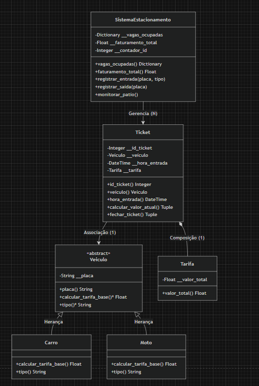

Sistema de Gerenciamento de Estacionamento (Desk App I)

Este projeto simula o painel de controle de um operário de estacionamento para um mercado, aplicando conceitos de Programação Orientada a Objetos (POO) em Python.

- Link do Vídeo de Apresentação
  https://youtu.be/ButLuRH-5bk

- Conceitos de POO Aplicados
Abstração: Classe abstrata `Veiculo` servindo de molde.
Herança: Classes `Carro` e `Moto` herdando de `Veiculo`.
Polimorfismo: Método de cálculo de tarifa base implementado de forma diferente em cada subclasse.
Encapsulamento: Atributos privados (`__`) protegidos por métodos Getters (`@property`).
Associação e Composição: Relações estruturadas entre as classes `Ticket`, `Tarifa` e `SistemaEstacionamento`.

- Modelagem UML
O diagrama de classes foi estruturado no draw.io e representa a arquitetura do software


- Como Executar o Projeto
1. Certifique-se de ter o Python 3 instalado.
2. Abra o terminal na raiz do repositório e execute os comandos:
   ```bash
   cd Estacionamento-POO
   python src/main.py
